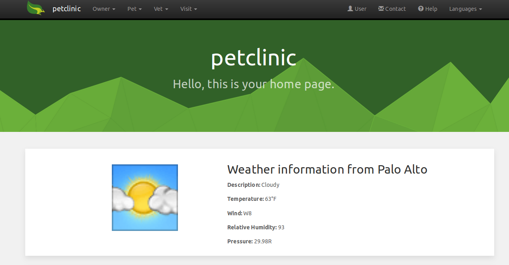

= Consume SOAP service using CXF

This proof of concept is based on petclinic sample application generated using link:http://projects.spring.io/spring-roo/[Spring Roo 2.0.0.M2] version.

It includes the necessary changes to show you how to configure an Spring Boot application to consume SOAP Services using Apache CXF.

== The service

In this proof of concept, we are going to consume the free link:http://wsf.cdyne.com/WeatherWS/Weather.asmx?WSDL[Weather web service] provided by link:http://cdyne.com[CDYNE].

CDYNE Weather is a free SOAP Web Service that provides you with up to date weather information in the United States. This information is derived from the National Oceanic and Atmospheric Administration's (NOAA) National Weather service into a clean and easy to parse XML format. The first method offers the city's weather by zip code, and the second shows the weather station's 7 day forecast by zip code. This free Weather Web Service also comes standard with hyperlinks that show images (GIF) of the day's weather conditions, so you can show off your application with visual representations.

For more information about this web service, you could check its link:http://wiki.cdyne.com/index.php/CDYNE_Weather[WIKI].

== Maven Plugin

To be able to use the operations provided by the Weather web service in our Spring Boot application is necessary to generate the Java classes related with each operation and each data type defined in the WSDL file. 

This operation could be do it manually, but CXF includes a Maven plugin which can generate java artifacts from WSDL automatically. This plugin should be included on the `pom.xml` file:

[source, xml]
----
<!-- Maven plugin that will generate Java classes from WSDL files -->
<plugin>
  <groupId>org.apache.cxf</groupId>
  <artifactId>cxf-codegen-plugin</artifactId>
  <version>${cxf.version}</version>
  <executions>
    <execution>
      <id>generate-sources</id>
      <phase>generate-sources</phase>
      <goals>
        <goal>wsdl2java</goal>
      </goals>
      <configuration>
        <sourceRoot>${basedir}/target/generated-sources/client</sourceRoot>
        <defaultOptions>
          <extendedSoapHeaders>true</extendedSoapHeaders>
          <autoNameResolution>true</autoNameResolution>
        </defaultOptions>
        <wsdlOptions>
          <wsdlOption>
            <wsdl>http://wsf.cdyne.com/WeatherWS/Weather.asmx?wsdl</wsdl>
            <packagenames>
              <packagename>com.cdyne.wsf</packagename>
            </packagenames>
          </wsdlOption>
        </wsdlOptions>
      </configuration>
    </execution>
  </executions>
</plugin>
----

NOTE: _For more information about the `cxf-codegen-plugin` and its configuration you could check the link:http://cxf.apache.org/docs/maven-cxf-codegen-plugin-wsdl-to-java.html[official plugin page]_

After include the plugin describes above and compile the project, the following classes will be generated under `target/generated-sources/client` automatically:

[source]
----
.
└── com
    └── cdyne
        └── wsf
            ├── ArrayOfForecast.java
            ├── ArrayOfWeatherDescription.java
            ├── Forecast.java
            ├── ForecastReturn.java
            ├── GetCityForecastByZIP.java
            ├── GetCityForecastByZIPResponse.java
            ├── GetCityWeatherByZIP.java
            ├── GetCityWeatherByZIPResponse.java
            ├── GetWeatherInformation.java
            ├── GetWeatherInformationResponse.java
            ├── ObjectFactory.java
            ├── package-info.java
            ├── POP.java
            ├── Temp.java
            ├── WeatherDescription.java
            ├── WeatherHttpGet.java
            ├── WeatherHttpPost.java
            ├── Weather.java
            ├── WeatherReturn.java
            └── WeatherSoap.java
----

== Integration Layer

Now that we have the necessary Java classes that will consume the SOAP web service, is necessary to publish these operations in the application. To do that, we're going to create the `WeatherWebService` interface on the `integration` package:

[source, java]
----
package com.springsource.petclinic.integration;

/**
 * = WeatherWebService interface
 *
 * This interface contains the necessary operations to obtain 
 * the City's Weather by ZIP Code. It's important to know that 
 * this operations only works with U.S. ZIP Codes.
 *
 */
public interface WeatherWebService {

  /**
   * Gets all information for each WeatherID
   * 
   * @return ArrayOfWeatherDescription object that contains a list 
   * of all weather information objects identified by the WeatherID.
   */
  public ArrayOfWeatherDescription getWeatherInformation();

  /**
   * Allows you to get your City's Weather, which is updated hourly. 
   * U.S. Only
   * 
   * @param zip String with the City's ZIP code that want to use
   * to get Weather information
   * 
   * @return WeatherReturn object that contains all information about
   * the weather of the provided city.
   */
  public WeatherReturn getCityWeatherByZIP(String zip);

  /**
   * Allows you to get your City Forecast Over the Next 7 Days, which is 
   * updated hourly. U.S. Only
   * 
   * @param zip String with the City's ZIP code that want to use
   * to get Forecast information
   * 
   * @return ForecastReturn object that contains the weather forecast over 
   * the next 7 days of the provided city 
   */
  public ForecastReturn getCityForecastByZIP(String zip);

}

----

After that, is necessary to create the `WeatherWebServiceEndpoint` implementation that will invoke the operations of the Java classes generated by the Apache CXF plugin:

[source, java]
----
package com.springsource.petclinic.integration;

/**
 * = WeatherWebServiceEndpoint
 *
 * Implementation of the WheatherWebService interface. This implementation delegates
 * on the Java classes generated by the _cxf-codegen-plugin_ from the WSDL file
 * located on http://wsf.cdyne.com/WeatherWS/Weather.asmx?WSDL.
 * 
 */
@Service
public class WeatherWebServiceEndpoint implements WeatherWebService {

  /**
   * Gets all information for each WeatherID.
   * 
   * Delegates on _getWeatherInformation_ operation defined on the
   * SOAP web service. 
   * 
   * @return ArrayOfWeatherDescription object that contains a list 
   * of all weather information objects identified by the WeatherID.
   */
  @Override
  public ArrayOfWeatherDescription getWeatherInformation() {
    Weather s = new Weather();
    WeatherSoap p = s.getWeatherSoap12();
    return p.getWeatherInformation();
  }
  
  /**
   * Allows you to get your City's Weather, which is updated hourly. 
   * U.S. Only
   * 
   * Delegates on _getCityWeatherByZIP_ operation defined on the
   * SOAP web service.
   * 
   * @param zip String with the City's ZIP code that want to use
   * to get Weather information
   * 
   * @return WeatherReturn object that contains all information about
   * the weather of the provided city.
   */
  @Override
  public WeatherReturn getCityWeatherByZIP(String zip) {
    Weather s = new Weather();
    WeatherSoap p = s.getWeatherSoap12();
    return p.getCityWeatherByZIP(zip);
  }

  /**
   * Allows you to get your City Forecast Over the Next 7 Days, which is 
   * updated hourly. U.S. Only
   * 
   * Delegates on _getCityForecastByZIP_ operation defined on the
   * SOAP web service.
   * 
   * @param zip String with the City's ZIP code that want to use
   * to get Forecast information
   * 
   * @return ForecastReturn object that contains the weather forecast over 
   * the next 7 days of the provided city 
   */
  @Override
  public ForecastReturn getCityForecastByZIP(String zip) {
    Weather s = new Weather();
    WeatherSoap p = s.getWeatherSoap12();
    return p.getCityForecastByZIP(zip);
  }

}
----

== Use it!

To be able to use this Weather service, is necessary to include in the Java class that you need to invoke it using `@Autowired` annotation under the web service interface. In this proof of concept, we just include the `WeatherWebService` in the `MainController`:

[source, java]
----
package com.springsource.petclinic.web;

@RooThymeleafMainController
public class MainController {

  @Autowired
  private WeatherWebService weatherService;

  @RequestMapping(method = RequestMethod.GET, value = "/")
  public String index(Model model) {
    model.addAttribute("application_locale", LocaleContextHolder.getLocale().getLanguage());

    // Getting weather from Palo Alto, California using its ZIP code
    WeatherReturn paloAltoWeatherInfo = weatherService.getCityWeatherByZIP("94304");
    
    // If weather information from Palo Alto is available, add it to model.
    if(paloAltoWeatherInfo != null){
      
      // First, obtain more information about the weather in Palo Alto, using its ID.
      List<WeatherDescription> weatherInfoList =
          weatherService.getWeatherInformation().getWeatherDescription();
      
      for(WeatherDescription weatherInfo : weatherInfoList){
        if(weatherInfo.getWeatherID() == paloAltoWeatherInfo.getWeatherID()){
          // Add weather info image to the model
          model.addAttribute("weather_info_image", weatherInfo.getPictureURL());
          break;
        }
      }
      // Add weather info object to model
      model.addAttribute("weather_info", paloAltoWeatherInfo);
    }

    return "index";
  }
}
----

As you could see on the example above, the method that returns the `index.html` page, includes the weather information of _Palo Alto, California_ on the model object. These items included on the model will be used on the index page to display the weather information:

[source, html]
----
<!-- Weather Information section -->

 
  <!-- Project info --> 
  
 
    
 
      <!-- Show image related with weather information -->
       
    
 
    
 
      <h2>Weather information from City</h2> 
      
<b>Description: </b>Description

      
<b>Temperature: </b>Temperature°F

      
<b>Wind: </b>Wind

      
<b>Relative Humidity: </b>Relative Humidity

      
<b>Pressure: </b>Pressure

    
 
  
 

----

== Execution

. Download this project or apply the changes above in your project
. Use `mvn clean compile spring-boot:run` command to run the application or use STS Spring Boot plugin to do it.
. Access to http://localhost:8080 and you will show the weather information about _Palo Alto, California_.

